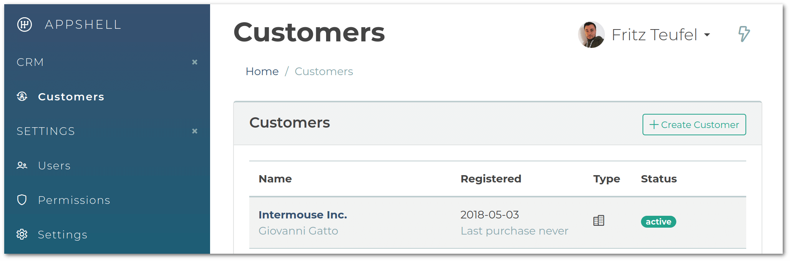
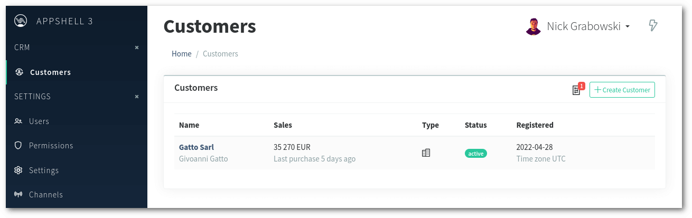

AppShell v3.0 has been released with a refreshed user interface and several smaller but breaking changes.

## Refreshed UI

**Before:**

**After:**

-->> create a splash screen along with a featured one
-->> make the article featured
-->> add screenshots with old and new, use vanilo screens, not default appshell ones
-->> maybe make a separate article for AppShell as well??

## Minimum Requirements

The AppShell package requires PHP 8.0 or PHP 8.1 and Laravel 9.x.

## Alpinejs Required, Vuejs is not

AppShell with v3.0 has replaced Vue to Alpinejs (3.10+) under the hood.

As a consequence you need to add Alpinejs to your application's frontend:
`npm add alpinejs@3.10` in order to build the Admin.
**Vuejs can still be kept**, but it can also be removed from your application
if you no longer need it (`npm remove vue`).

The only difference is that AppShell no longer needs Vue, but it requires Alpinejs.

## Possibly Breaking Changes

### The Scripts Sections

The `scripts` section of the admin layout has become a
[stack](https://laravel.com/docs/9.x/blade#stacks)
(it used to be a [section](https://laravel.com/docs/9.x/blade#defining-a-layout))

If your extra admin modules extend the `scripts` section, then replace
`@section('scripts')` references with `@push('scripts')`. If there are `@parent()`
references within the section, remove them.

> For a complete list of BCs and upgrade instructions see the [AppShell 3 Upgrade Guide](https://konekt.dev/appshell/3.x/upgrade#2x-30)

Wish you all a smooth upgrade! 🎉
