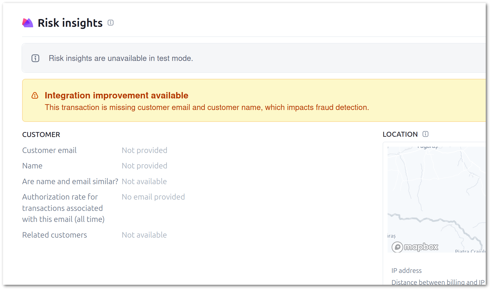

The Stripe Module for Vanilo has been updated which brings a new feature and two improvements.

## Improvements

PHP 8.4 is now fully tested and supported.

### UX/UI Improvements

The UX of the default HTML snippet that handles the payment procedure and the hosted fields is finally in an acceptable
state from the UX perspective.


- Clear instructions for the shopper have been added;
- Success and error feedbacks are now straightforward;
- Backend and frontend warnings are now displayed differently, reflecting the importance of their role in the payment process;  
- The card input fields are no longer being shown after a successful payments;
- All messages are now translatable;
- Paddings, margins, font sizing now make sense by default.

## Stripe Customer Creation

Before v2.2, the module has created payment intents, but no customers. This is perfectly fine, but you may have seen
a suggestion from Stripe stating that "Integration Improvement Available" and sending over customer data would improve
Stripe's fraud detection.



Beginning with version 2.2 of the Vanilo Stripe module, this is possible, by setting the `STRIPE_CREATE_CUSTOMER` dotenv
variable to `1` or `true`.

```dotenv
STRIPE_CREATE_CUSTOMER=1
```

As a result, when creating a payment, the Stripe module will send the customer data using the fields from the order's
Billpayer information.

Stripe requires the integrations to create customer records, i.e. it is not possible to simply send the customer data
without creating a customer first. Therefore, the procedure under the hodd is the following:

1. If the create customer feature not enabled, no customer data is handed over to Stripe (as until v2.1)
2. If the feature is enabled, existing customer will be looked up at Stripe, based on billpayer's email
3. If there's no customer with the given email at Stripe, a new entry will be created
4. The customer id (either newly created or existing) will be submitted along with the payment intent creation