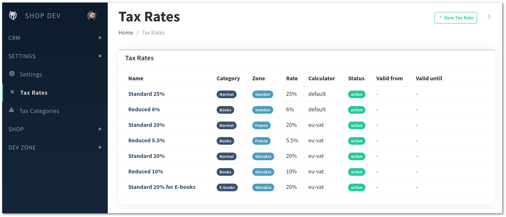

Vanilo 4.0 has been released with Laravel 11 support, new checkout, order and adjustment features.

## Laravel 11

Beginning with v4.0, Vanilo supports Laravel 10 and 11, and PHP 8.2 and 8.3.

## New Features

### Tax Engine Extensions

Added the generic `Taxable` interface, and the Foundation's `CartItem`, `Product` and `MasterProductVariant` are now "taxables".

Added the extendable `TaxEngine` (facade) that can resolve tax rates from taxables, billing/shipping addresses, a place
for various country-specific taxation drivers.
Added the DefaultTaxCalculator which - calculates simply by rate. The DeductiveTaxCalculator class deducts the amount from
gross prices.

Added the `CalculateTaxes` listener to cart update and shipping address change events so that configured taxes are applied
as adjustments.

### Configurable Products

Added Cart Item configuration support. Different configurations constitute separate cart items even when the underlying
product is the same. The configuration can be passed to the `Cart::addItem()` method.

The configurations are persisted to the order items table accordingly.

### Multi-currency Support

Each order record can have a separate currency. Existing orders without explicit currency are considered as having the
globally configured default currency

### Hidden Properties

Properties now can be hidden, which means they can be hidden from the storefront and filters, but can be still used for
internal logic-related considerations.

## Version Updates

- The default image handler is now using Laravel Media Library v11
- The Address module has been updated to v3.3+ (which adds the Zoneable behavior and the EuropeanUnion helper)

## Admin Improvements

### Tax Features

Tax Category and Rate editing has been added to the Admin package

Additionally, the tax category can be assigned to products on their edit forms.

### Channel Assignments

Channel assignments can be edited on the products, shipping methods and payment methods pages.

When assigning an entry (product, payment/shipping method) to a channel, it means that it will only be
available in the given channels.

### Channel Configuration

The channel form now contains the `domain`, `currency`, shipping and billing zone fields.
Setting billing/shipping zones for a channel can be used to geographically restrict customers and shipping destinations
per channel.

### Payment Method Zone

The geographic zone of a payment method can now be edited on the admin. This can be used to dynamically show or hide
certain payment methods based on the billing address at the checkout.

### Backorder Support

Beginning with v4.0, it is possible to define a "backorder" behavior on a per-product basis. It means that if the product
is out of stock, orders can be still accepted either in a limited (X additional units) or unlimited manner.

## Improvements

- The `ProductSearch` class can now limit and sort results, and filter by slug, channel(s).
- Added the `withImages` and `withChannels` methods to the product search class (eager loads media)
- The `payment_method_id` is now stored with orders. Earlier it was obtained by the current payment, but it could be ambiguous due to an order possibly having multiple payments.
- The PaymentMethod model is now "zoneable", i.e. it can be restricted to specific geographic zones.
- A `SimpleTaxDeduction` adjuster has been added. It can be used when to deduct taxes from gross prices.

### Extended Multi-Channel Support

Added the `channelables` table for being many-to-many polymorphic relationships with channels and arbitrary models.

Products, Master Products, Taxonomies, Payment Methods and Shipping Methods are now channel-aware.

## New Domain Events

The following new events have been added:

- `BillpayerChanged` (on checkout),

## Removed Items

- Removed the Vanilo v2 Framework namespace compatibility layer
- Removed the throwing of `CartUpdated` event when destroying a cart (`CartDeleting` and `CartDeleted` events remain)
- Removed the deprecated `BuyableImageSpatieV7` and `BuyableImageSpatieV8` traits

> For the full list of changes, including BCs, see the [Vanilo 4.0 Changelog](https://github.com/vanilophp/framework/blob/4.0.0/Changelog.md#400)
