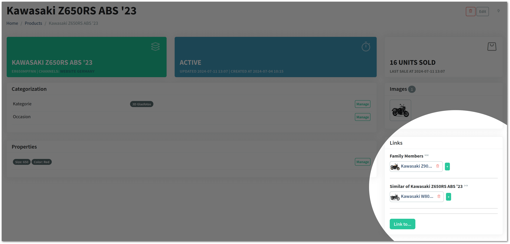

Vanilo 4.1 has been released with improved orders, links, product search and categorization features.

## Product Search Improvements

The `priceGreaterThan`, `priceLessThan`, and `priceBetween` methods have been added to the `ProductSearch` class, which
has also become `Macroable`. It means, that you can extend it easily in your application without overriding the class.

> See the [Laravel Documentation](https://laravel.com/docs/11.x/collections#extending-collections) to see how Laravel Macros can be used.

## Links Extended

The [Links Module](/docs/4.x/links) allows you to define relationships between two or more products, variants, taxa or taxonomies.

These are graph-like connections between entries without a having a real graph database and can be used for cross-sell,
upsell and recommendation features.

Until Vanilo 4.1, the connection between two entries was always bidirectional. Beginning with 4.1, it is possible
to define unidirectional relationships, e.g. "Slim Case" is the accessory of iPhone 13, but the iPhone 13 is not an
accessory of Slim Case.

To support these cases, the Links API has been extended with:

- `isUnidirectional()`, `isOmnidirectional()` and `isEmpty()` methods on the `LinkGroup` class;
- `pointsTo()` method on the `LinkGroupItem` class;
- the possibility to retrieve the link items directly as `Get::the($type)->linkItems()->of($model)` and
- the `link_items` helper.

It is also possible to force new link group creation using the `Establish::new()` method.

## Extended Order Totals

To simplify the subtotal calculations, the `taxes_total`, `shipping_total` and `total` attribute getters have
been added to the Foundation Order model. They help you to display these subtotals on the storefront without getting
your hands dirty with the internals of these calculations.

## New Taxon Content Fields

The following new fields have been added to the Taxon model/table:

- `subtitle`
- `excerpt`
- `description`
- `top_content`
- `bottom_content`

These fields can be used to enrich the specific category pages, mega menus and other areas where the taxon is displayed
on the StoreFront.

## Admin Improvements

It is now possible, to create, edit and delete links between products:

## Misc Improvements

- Added the discountable shipping fee calculator;
- Added support for configurable decimal separator used by the `format_price()` helper function

> For the full list of changes, including BCs, see the [Vanilo 4.1 Changelog](https://github.com/vanilophp/framework/blob/4.1.0/Changelog.md#410)
