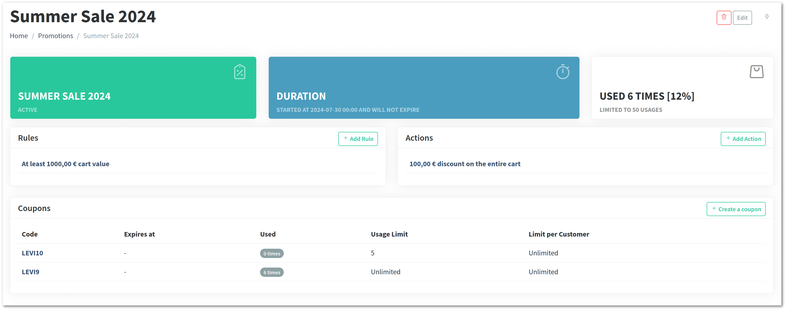
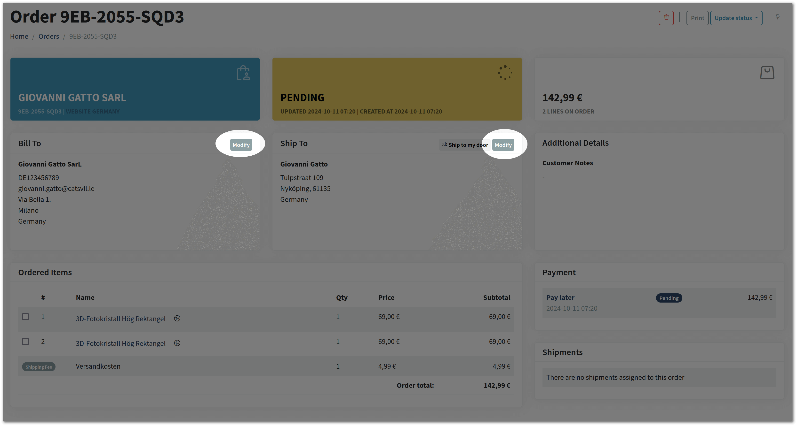

Vanilo 4.1 has been released with improved orders, links, product search and categorization features.

## Promotion Module

The promotion module has been added with the following features:

- Define promotions with priorities, time and usage limits
   - Add promotion rules like "minimum cart value"
   - Add promotion actions like "% discount", or "Fixed $10 discount"
- Add coupons that can activate promotions with usage limit and expiration date

The total amount of promotions can be obtained from an order using the `$order->promotions_total` property.

### Checkout Extensions for Promotions

The Checkout implementations have been extended with the `addCoupon()`, `removeCoupon()`, `hasCoupon()`, `getCoupons()`,
`hasAnyCoupon()`, `getPromotionsAmount()` and `setPromotionsAmount()` methods.

> To avoid breaking changes, these methods are not part of the Checkout interface, but they will be added in v5.

The following checkout events have been added:

- `CouponAdded` (to checkout)
- `CouponRemoved` (from checkout)
- `CouponUtilized` (after a successful checkout converted to an order)
- `PaymentMethodSelected`

Added a listener to update coupon and promo usage after a `CouponUtilized` event (Foundation)

## Other Improvements

- Added the `PercentDiscount` adjuster class
- Added a listener to recalculate shipping fees after a `PaymentMethodSelected` event (Foundation)
- Added `domain` field to the orders table
- Added then automatic completion of `$order->domain` from the current request to the `OrderFactory`
- Added the `OrderBillpayerUpdated` and `OrderShippingAddressUpdated` events

## Admin Improvements

It is now possible to modify the billing and shipping addresses of an existing order in the admin:

## Misc Improvements

- Added the discountable shipping fee calculator;
- Added support for configurable decimal separator used by the `format_price()` helper function

> For the full list of changes, see the [Vanilo 4.2 Changelog](https://github.com/vanilophp/framework/blob/4.2.0/Changelog.md#420)
