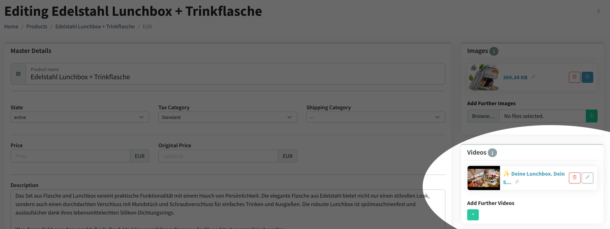
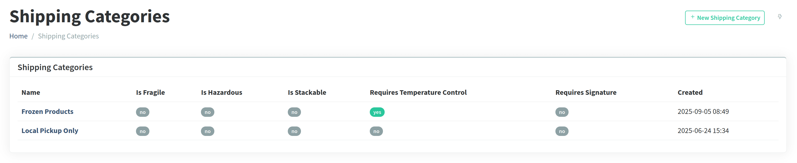
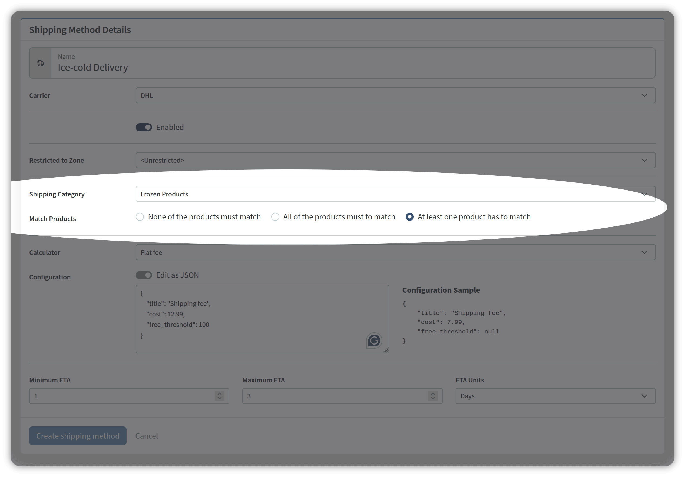
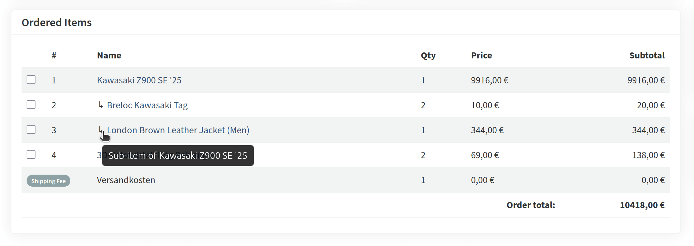

Vanilo 5.0 has been released with support for videos, translations and Laravel 12.

## Supported Versions

- PHP 8.2 support has been removed; PHP 8.3 & 8.4 are supported
- Laravel 10 is still supported, but v10.48 is minimally required
- Laravel 11 and Laravel 12 are both supported

## Video Module

The video module has been added with the following features:

- Define videos for **any eloquent model**, out of the box support for products, master products, variants, taxonomies and taxons;
- Built-in Youtube driver;
- Add your own custom driver (Vimeo, etc).



### Add a Video to a Product


## Cart Improvements

- It is possible to force creating new items when adding the same product multiple times to the cart
- Added subitem support (more details below)
- Added the `CartItem::isShippable()` method

## Subitem Support

Subitem support means that a product in the cart/order can have dependent or nested items attached to it.

For example, a main product (like a laptop) might have subitems such as an extended warranty, software add-ons,
or accessories that stay linked to the parent product.

This allows merchants to sell bundled, customizable, or add-on options while keeping the relationship between the
main item and its extras clear in the cart and checkout flow.

It also can be crucial when certain items need to be packed or manufactured together.

Both cart items and order items support subitems.

To support this, the following new features have been added:

- The `addSubItem()`, `getRootItems()` and `getState()` methods have been added to the Cart.
- The `hasChildItems()` and `getChildItems()` methods have been added to the CartItem.
- The `hasParent()`, `getParent()` methods have been added both to CartItem and OrderItem classes.

## Shipping Improvements

### Shipping Categories

Shipping categories are used to group products with similar shipping rules, such as weight restrictions,
handling requirements, or carrier preferences.

They allow store owners to apply different shipping rates, methods, or conditions based on the product type
— for example, standard items, fragile goods, or oversized packages.

This makes shipping cost calculation and shipping method availability more accurate and flexible.



Shipping categories can be assigned to shipping methods and decided how the products influence the availability of
the shipping method.



### Shipping Method Availability

Every shop has different shipping rules and conditions.

To support this in a flexible way, a customizable class: `AvailableShippingMethods` has been added.

```php
use Illuminate\Http\Request;
use Vanilo\Checkout\Contracts\Checkout;
use Vanilo\Foundation\Shipping\Method\Eligibility\AvailableShippingMethods;

class CheckoutController extends Controller
{
    public function show(Request $request, Checkout $checkout)
    {
        return render('shop::checkout.show', [
            'checkout' => $checkout,
            'shippingMethods' => AvailableShippingMethods::forCheckout($checkout)->get(),
            // ...
        ]);    
    }
}
```

By default, the `AvailableShippingMethods` class checks the shipping method's availability based on the shipping
cart item products' shipping category and the shipping address' zones.

If you don't want any of the default checkers, you can instruct the class to skip them:

```php
use Vanilo\Foundation\Shipping\Method\Eligibility\AvailableShippingMethods;

AvailableShippingMethods::forCheckout($checkout)
    ->withoutZoneCheck()
    ->withoutCategoryCheck() 
    ->get();
```

You can add further checkers, e.g. the channel checker, which verifies that the shipping method is available for
the current channel:

```php
use Vanilo\Foundation\Models\Channel;
use Vanilo\Foundation\Shipping\Method\Eligibility\AvailableShippingMethods;
use Vanilo\Foundation\Shipping\Method\Eligibility\ChannelChecker;

$currentChannel = Channel::first(1);

AvailableShippingMethods::forCheckout($checkout)
    ->withoutZoneCheck()
    ->addChecker(new ChannelChecker($currentChannel)) 
    ->get();
```

You can write your own checkers, by implementing the `Vanilo\Foundation\Shipping\Method\Eligibility\Checker` interface
and adding it to the `AvailableShippingMethods` instance by calling the `addChecker()` method.

### Shipping Method ETA

E-commerce shipping ETA ranges, like "delivers in 24–48 hours" help set clear customer expectations by showing when
an order is likely to arrive.

They can also be used in checkout and product pages to increase trust and influence buying decisions.

To support this, 3 ETA fields have been added to the shipping method model:

- minimum
- maximum
- unit (days, hours, minutes, etc)

## Product Features

### GTIN Support

The GTIN (Global Trade Item Number) field in an e-commerce product is a standardized identifier (such as UPC, EAN, or ISBN)
used to uniquely identify products worldwide for inventory, listings, and search visibility.

For example, Google Merchant Center requires GTINs in product feeds to improve ad performance and ensure accurate product
recognition across different sellers. Unlike a merchant’s internal SKU, which is unique only within their own system,
the GTIN is a universal code that helps customers find the exact same product across multiple retailers.

The `gtin` field has been added to the product/variant models.

### Product Availability Improvements

The `unlisted` product state has been added. This state means that the product is active but hidden on the list pages
and in search results. It can be viewed by navigating directly to its URL.

Added the ProductAvailabilityScope enum class with listing, viewing and buying values

A new enum, the `ProductAvailabilityScope` enum with `listing`, `viewing`, and `buying` has been introduced.

This is basically a way to define **in which contexts a product is considered "available" in your e-commerce system**.

Each value represents a different "layer" of customer interaction with the product:

- `listing` → The product is allowed to appear in *product listings* (category pages, search results, homepage widgets, etc.).
   - If not available for `listing`, the product won’t show up in bulk/multi-product contexts, but could still be accessible if someone knows its direct link.
- `viewing` → The product can be seen on its *individual product page*.
   - This means the product detail page is accessible.
   - If not available for `viewing`, even with a direct URL, customers wouldn’t be able to open the product page (404, hidden, or "unavailable" message).
- `buying` → The product can actually be *purchased*.
   - Customers can add it to their cart and complete checkout.
   - If not available for `buying`, the product may still be visible (in listings or detail pages), but the “Add to Cart” or “Buy Now” buttons will be disabled or absent.

💡 In practice:

- A product might be `listing` + `viewing` available, but not `buying` (eg. an upcoming product, or discontinued item that’s still shown for reference).
- Another might be `viewing` only, but not `listing` (eg. special direct-link products not publicly discoverable).
- Or it might be all three (`listing`, `viewing`, `buying`) — the normal case of an actively sellable product.

To make this easy to use, the following methods have been added to the `ProductSearch` class:
    - `forListing()` - static factory method that initializes with a listable global scope
    - `forViewing()` - static factory method that initializes with a viewable global scope
    - `forBuying()` - static factory method that initializes with a buyable global scope

## Other Features and Improvements

- Added the `StaggeredDiscount` promotion action type - dynamic % discount depending on the ordered quantity
- Added the `extra_digit` flag to the Time Hash generator that created 4+4+4 char number (eg. "77IG-13T3-5FH9") instead of 3+4+4 ones (eg. "77I-13TX-C002")
- Added the `ProductSearch::excludingSkus()` method
- Added [the dual-field logic](https://vanilo.io/docs/5.x/master-products#reason-behind-dual-present-fields) enum conversion to the MasterProductVariant model's `state` field

## Admin Improvements

- Added the `gtin` field to the product and master product variant forms
- Added sorting and filtering options to the Product index
- Added support for displaying sub order-items in a distinguishable manner on the order show page
- Added ETA fields to the Shipping Method forms
- Added Info Widgets to the Channel Show Page
- Added the `order/show/_extra_actions` partial so that apps can add buttons to the order show page
- Improved the Order list performance by adding eager loading
- Changed the minimum length of a variant from 2 -> 1 (eg. when a t-shirt is of size "S")
- Added Video CRUD
- Various fixes for Links
- Added option to link Master Products to other products
- Added option to sort the product list by `last_sale_at` field (most recently sold/longest ago sold)

**Subitems in the Order Admin**



> For the full list of changes, see the [Vanilo 5.0 Changelog](https://github.com/vanilophp/framework/blob/5.0.0/Changelog.md#500)
