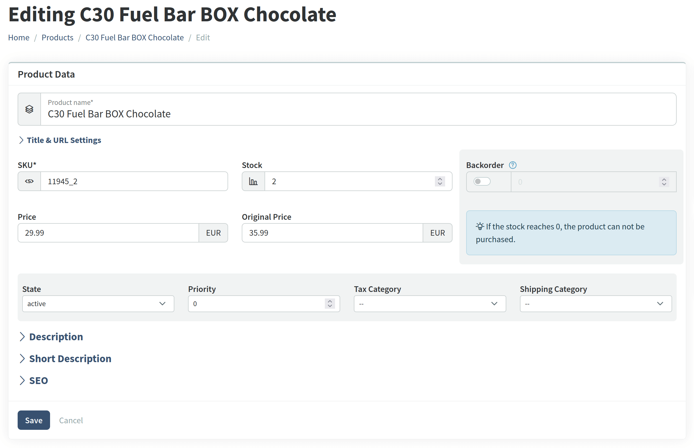

Vanilo 5.1 has been released with PHP 8.5 support, cart item level adjustments (taxes, promotions), product priority support and many more.

## Supported Versions

- PHP 8.3, 8.4 and 8.5 are supported
- Laravel 10 is still supported, v10.48 remains the minimum requirement
- Laravel 11.46.2 is the minimum requirement for the v11 series, and
- Laravel 12.38 is the minimum requirement for the v12 line.

## Event Improvements

The `SerializesModels` trait has been added to the base cart, checkout, payment and order events.
This significantly **reduces the payload size when such events are queued**, and prevents errors due to message
size limitations on transports like AWS SQS.

**Shipment event classes have been added** like created, delivered, ready, lost, etc.

The `PromotionUtilized` has also been added.

## Image Improvements

Added support to media settings `background` and `format`

```php
// config/vanilo.php
return [
    // ...
    'foundation' => [
        'image'       => [
            'product' => [
                'variants' => [
                    'thumbnail' => [ // Name of the image variant
                        'width'  => 250,
                        'height' => 250,
                        'fit'    => 'crop'
                        'format' => 'png', // converts to PNG regardless of the source image format
                    ],
                    'cart' => [ // Image variant names can be arbitrary
                        'width'  => 120,
                        'height' => 90,
                        'fit'    => 'crop',
                        'format' => 'original' // preserves the uploaded file type, equals to `keepOriginalImageFormat()`
                        'background' => 'white'
                    ],
                ],
            ],           
        ],
    ],
    //...
];
```

> Refer to [Spatie Media Library](https://spatie.be/docs/laravel-medialibrary/v11/converting-images/defining-conversions) and [Spatie Image](https://spatie.be/docs/image/v3/image-manipulations/image-canvas) to see the accepted values as `format` and `background`. 


## Adjustment Improvements

Added the polymorphic `source` relation/fields to the `Adjustment` model. This way, there's an explicit way of telling
about an adjustment, which model was its source. Until here, the `origin` field was supposed to do this, but that was
ambiguous, context-dependent and unspecified. The origin field can still hold information like the coupon code for example.

To support this, the `getSource` and `setSource` methods have been added to the `Adjustment` model. They aren't part of
the interface yet, but will be added in v6.

## Tax Module Features

Added support for the `included` config parameter for the `DefaultTaxCalculator` and the `DeductiveTaxCalculator` classes
which is essential in situations where the retail prices already contain the taxes.
Also added a different formula to the `SimpleTax`/`SimpleTaxDeduction` adjusters to properly calculate the tax amount
when Tax is included in the price.

The `vanilo.taxes.engine.use_shipping_address` config value is now being passed to the Simple Tax Engine driver's constructor.

## Promotion Features
 
Added the cart item percent discount promotion action type which adds **support discount on a given item, not just the entire cart**.
To make things clear, the cart fixed and percent discount promotion actions now only act on carts, not on cart items.

Added the static `getAvailableWithoutCoupon()` and `getAvailableOnes()` methods to the `Promotion` model.
They aren't part of the interface yet, but will be added in v6.

Added the `active()` and `notDepeleted()` scopes to the `Promotion` model

There is a new listener, the `UpdatePromotionUsage` listener, which gets triggered upon the new `PromotionUtilized` event (Foundation).
To support this, the `UpdateCouponUsage` listener no longer increments the usage of the coupon's promotion.

The `CalculatePromotions` listener now saves the `source` of the created adjustments.

The applied **promotions** during the checkout now contain **detailed amounts, not just the grand total**.

From v5.1 the eligible **promotions without coupons are automatically applied** and **individual cart items can also be promotion subjects**.

## Product Features

Two new fields, the `priority` and `subtitle` have been added to the `products`, `master_products` and `master_product_variants` tables.

The `ProductSearch` class now **sorts products by `priority` by default**, unless a different sorting condition is applied.

Proper support for using the listing scope (active/unavailable states) on master product variants has been added:

```php
$masterProduct->getListableVariants();
// or
$masterProduct->listable_variants;
```

This feature makes it straightforward to work with various states of product variants.

## Video Module
 
Changed the default-generated video hash to a base 58 ULID instead of nano id.

## Admin Improvements

The product form has been reworked. Fields have been reorganized, and sections that are used less often
are collapsed by default, to improve the clarity of the form.



The new v5.1 product fields, `priority` and `subtitle` have also been added to the form.

The list of products in admin can be sorted by priority as well.

Additionally, validation improvements and various fixes have been shipped with Admin v5.1 