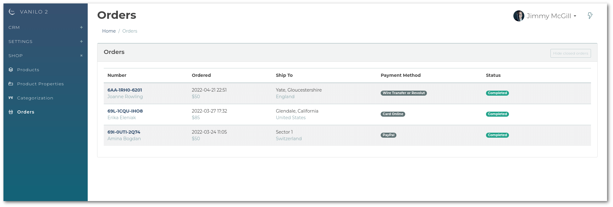
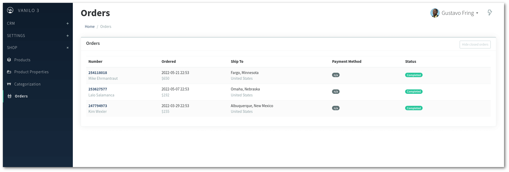

Vanilo Admin v3.0 has been released with a refreshed user interface and several smaller changes.

It's been around since March, but due to a stubborn bug, it wasn't tagged as final `3.0.0` for a while.
Now, all the known issues have been repaired and v3 has been finalized.

The Vanilo Admin has become an optional and standalone module as of Vanilo v3.0.

## Refreshed UI

**Before:**

**After:**

## Minimum Requirements

As part of the Vanilo 3 series, the Admin package requires PHP 8+ and Laravel 9.

## Alpinejs Required, Vuejs is not

The Admin module is built on top of [AppShell](https://konekt.dev/appshell) and
that component it has been upgraded to (v3.0).

AppShell with v3.0 has replaced Vue to Alpinejs (3.10+) under the hood, and along with that,
Vanilo Admin has also ported some of its features from Vue to Alpinejs. 

As a consequence you need to add Alpinejs to your application's frontend:
`npm add alpinejs@3.10` in order to build the Admin.
**Vuejs can still be kept**, but it can also be removed from your application
if you no longer need it (`npm remove vue`).

The only difference is that the Admin no longer needs Vue, but it requires Alpinejs.

> See the [Admin Installation Documentation](https://vanilo.io/docs/3.x/admin-installation) for more details.

## Possibly Breaking Changes

### The Scripts Sections

The `scripts` section of the admin layout has become a
[stack](https://laravel.com/docs/9.x/blade#stacks)
(it used to be a [section](https://laravel.com/docs/9.x/blade#defining-a-layout))

If your extra admin modules extend the `scripts` section, then replace
`@section('scripts')` references with `@push('scripts')`. If there are `@parent()`
references within the section, remove them.

> For a complete list of BCs and upgrade instructions see the [AppShell 3 Upgrade Guide](https://konekt.dev/appshell/3.x/upgrade#2x-30)

If you have issues or questions regarding the Vanilo Admin v3 upgrade, feel free to [open an issue at Github](https://github.com/vanilophp/admin/issues).
